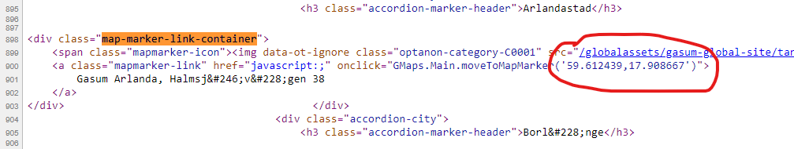

## Description
This project explores ways to use Python libraries for extracting data from arguments of HTML tags, and then enriching it with information from other sources.

## Task
A service proivder has a map of their locations available on the website https://www.gasum.com/sv/hallbara-transporter/tung-trafik/tankstationer/. Unfortunately, they do not offer an option to download list of all locations in a single file. But we can parse the HTML code of the webpage to extract GPS coordinates of all locations, which service provider have placed on their map. Additionally, we can get other information with extracted GPS coordinates using Nominatim - a tool to perform reverse geocoding.

Coordinates of each location are stored as attributes of anhcor tag. We want to get all sibling DIV tags, who have anchor tag with coordinates as their child elements. 

## Ethical considerations
* In their Usage Policy, Nominatim allows **an absolute maximum of 1 request per second**. We must limit the frequency of reverse geocoding requests. https://operations.osmfoundation.org/policies/nominatim/
* Some websites explicitly prohibit using parsers to collect data from their HTML code. https://www.gasum.com/ doesn't seem to have such restriction.

## Solution

## Result
| name | latitude | longitude | type | city | country | country_code |
| --- | --- | --- | --- | --- | --- | --- |
| Gasum Arlanda, Halmsjövägen 38 | 59.61275773893676 | 17.908721332218004 | square_truck_rgb.svg | Sigtuna kommun | Sweden | se |
| Gasum Borlänge, Gjutargatan 24 | 60.4735781 | 15.4121377 | square_truck_rgb.svg | Borlänge | Sweden | se |
| Gasum Bålsta, Björnängsvägen 1 | 59.5813747 | 17.4917913 | square_construction_rgb.svg | Bålsta | Sweden | se |
             
